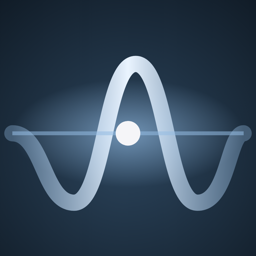
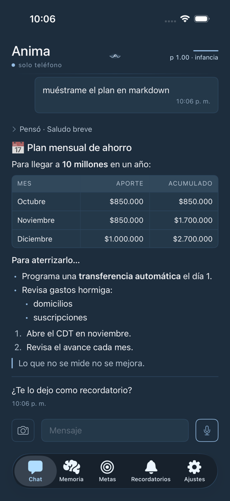
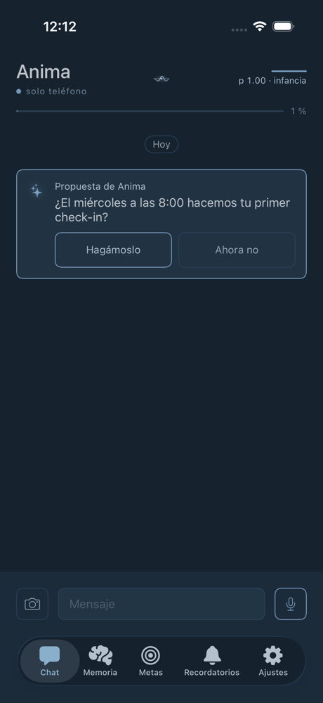
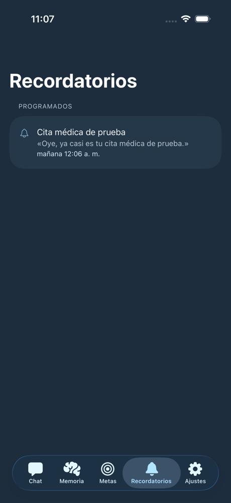
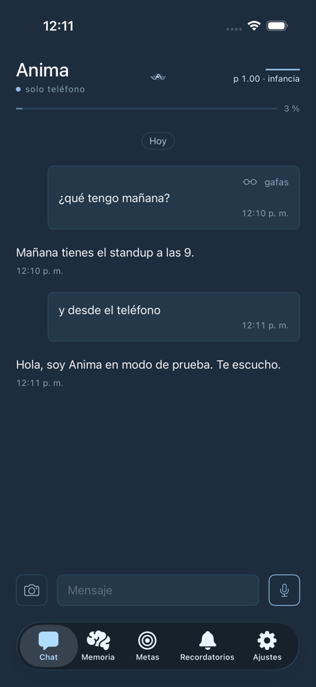

<p align="center">
  
</p>

<h1 align="center">Anima para iOS</h1>

<p align="center">
  <b>Tu asistente personal con forma de mente — recuerda, duerme, desea y cambia con el tiempo.</b><br/>
  <i>Runtime edge (Swift) del harness <a href="https://github.com/anima-mind/anima">Anima</a>.</i>
</p>

<p align="center">
  
  
  
  
</p>

<p align="center">
  
  
  
  
  
  
</p>

> Una mente = LLM (dotación) + harness (desarrollo) + historia (experiencia).

Anima no es un chat con memoria: es la implementación en el teléfono de un **spec de arquitectura cognitiva** construido a partir de la lingüística de Chomsky, el psicoanálisis de Lacan y la neurociencia de la memoria de Kandel. El diseño, la investigación y sus límites viven en el blueprint: **[anima-mind/anima](https://github.com/anima-mind/anima)**.

## Qué hace

- **Conversa y te conoce.** Chat con texto, voz y fotos; markdown real (tablas, listas, títulos).
- **Duerme y consolida.** Cada noche, mientras cargas el teléfono, destila el día en memorias durables, reconsolida las viejas y reflexiona. Al despertar te cuenta qué ordenó.
- **Tiene identidad con plasticidad.** Al principio se moldea libremente; con las noches se estabiliza y los cambios de identidad requieren tu aprobación (`p(n) = 0.05 + 0.95·e^(−n/30)`).
- **Desea lo que tú deseas.** Tus metas (declaradas o inferidas, sin duplicados) motivan propuestas y **seguimientos** proactivos acotados.
- **Te recuerda en su voz.** Recordatorios propios de Anima —distintos de la agenda del iPhone— con notificaciones locales, acciones "Hecho / En 1 hora" y seguimiento en el chat.
- **Actúa con permiso.** Calendario, recordatorios, notas, cámara… cada acción que toca el mundo pide confirmación (o "Autorizar siempre", revocable). **Nunca afirma haber hecho algo que no ejecutó.**
- **Aprende skills** conversando ("Enséñame algo") y las automatiza con la práctica.
- **Un segundo cuerpo, opcional:** gafas **Meta Ray-Ban Display** (DAT SDK 1.0) con HUD, voz manos libres y cámara.

## Modos de mente

| Modo | Dónde piensa | Costo |
|---|---|---|
| **Solo teléfono** | 100 % en el dispositivo con Apple Foundation Models (tools adaptadas a un modelo de 3B) | Gratis, sin red |
| **Claude / OpenAI / Gemini** | El proveedor que elijas, con **tu propia key** | Lo que consumas |
| **Híbrido** | Conversación en la nube; sueño y pulsos en el teléfono | Menor |

Tus keys viven en el **Keychain** del teléfono; no hay backend propio. La memoria, las metas y las skills son locales.

## Arquitectura

```
AnimaKit (Swift Package, dominio puro y testeable)
├── Loop / WorkingMemory      el agent loop, contexto con presupuesto por modelo
├── Provider                  Claude · OpenAI-compat (OpenAI, Gemini) · Foundation Models
├── Symbolic · Real · Brain   historial, fallos que insisten, memoria y sueño (Consolidator)
├── SelfModel                 identidad con plasticidad decreciente + aprobaciones
├── Desire · Proactive        metas, intenciones, recordatorios, seguimientos, pulso en background
├── Sensorimotor / Tools      tools tipadas con permisos, skills, perfiles por proveedor
├── Glasses                   cuerpo DAT: HUD, voz HFP, cámara, diagnóstico
└── UI · Design               SwiftUI + tokens de diseño
App/                          shell iOS (XcodeGen): notificaciones, BGTasks, Firebase, gafas
```

Mapeo detallado subsistema por subsistema: [plan de implementación (doc 04)](https://github.com/anima-mind/anima/blob/main/docs/04-swift-implementation-plan.md).

## Calidad

- **~1 000 tests** del paquete (Swift Testing) con gate de cobertura **≥ 90 %** en CI.
- **XCUITests** de los flujos principales en simulador.
- **Smoke con modelos reales** (opt-in): Claude, OpenAI, Gemini y el modelo de Apple — decenas de frases reales ("recuérdame mañana a las 9…", "¿qué tengo pendiente?") verificadas contra lo que de verdad se guarda.
- Cada lote de cambios pasa por una **review independiente** que prueba en simulador antes de mergear.
- CD: cada merge a `main` sube un build a TestFlight.

## Desarrollo

```bash
swift build && swift test                     # el paquete
./scripts/coverage-gate.sh                     # tests + gate de cobertura
cd App && xcodegen generate && open Anima.xcodeproj   # la app
./scripts/ui-test.sh <UDID>                    # XCUITests en un simulador
```

Requisitos: Xcode 26, iOS 26. Las credenciales (keys de proveedores, Firebase, Meta) **nunca entran al repo**: plantilla de Firebase en `App/GoogleService-Info.template.plist` y `App/Secrets.xcconfig` (gitignored).

## Estado

🧪 **En pruebas de campo** (TestFlight interno). Próximo: widgets, CarPlay (voz) y App Store.

## Widgets y App Group

- App Group `group.com.joshuamoreno1.anima.widgets` (app + extensión `com.joshuamoreno1.anima.widgets`; constante única en `AppGroup.identifier`).
- **Base de datos**: `anima.sqlite` vive en `<grupo>/Database/`. La mudanza desde `Documents` corre UNA vez al arrancar (`DatabaseRelocation`): checkpoint del WAL → copia con la API de backup de SQLite → `integrity_check` + mismo esquema + mismas filas en TODAS las tablas → rename atómico; la vieja queda como `Documents/anima.sqlite.migrated` y se purga recién tras 3 aperturas buenas de la base del grupo en arranques posteriores. Si la base ya vive en el grupo y el binario no alcanza el grupo (sin entitlement), la app NO abre ninguna base (ni vacía ni la `.migrated`) y muestra el error. Cualquier fallo antes de instalar ⇒ se sigue con la de `Documents` intacta y se reintenta el próximo arranque. En el grupo va en rollback journal (sin `-shm` con lock vivo al suspender). `Documents/skills` no se mueve.
- **Widgets** (`App/Widgets`, vistas e intents compartidos en `App/WidgetsShared`): leen SOLO `<grupo>/Widgets/WidgetSnapshot.json`, que la app reescribe tras cada sync proactivo, al cerrar una noche y al ir a background. La extensión jamás abre GRDB: linkea solo `AnimaWidgetCore` (snapshot, copy, deep links, tema, BreathMark, cola de botones; sin GRDB), que `AnimaKit` re-exporta.
- **Botones** ("Hecho", "Sí, avancé"): cada tap queda durable en `<grupo>/Widgets/Actions/` (un archivo por acción) y el widget se repinta optimista; la app los aplica con el mismo `ProactiveActionHandler` de las notificaciones — de inmediato si iOS corre el intent en su proceso (`LiveActivityIntent`), o al abrir / volver / en el pulso de background.
- Deep links: `anima://reminders`, `anima://goals[?id=]`, `anima://chat?mic=1` (Centro de control / botón de Acción).

## Licencia

Código bajo **[PolyForm Noncommercial 1.0.0](LICENSE)**: puedes leerlo, estudiarlo y usarlo con fines no comerciales; el uso comercial requiere permiso. Las versiones publicadas antes de este cambio siguen bajo MIT. **Anima** y su logo son marcas de Joshua Moreno; la licencia no otorga derechos sobre ellas.

<p align="center"><sub>Un proyecto de <a href="https://github.com/anima-mind">anima-mind</a> · Joshua Moreno · 2026</sub></p>
